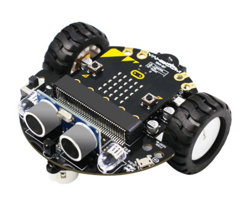

# mimi-ble-terminal  
A simple Linux terminal for sending commands to and receiving messages from a Mimi-robot over BLE (UART-over-BLE protocol).



Mimi-robot (short for Micro-Mitya) is a robot based on the [**micro:bit**](https://microbit.org/) controller and the [**Tiny:bit**](https://www.yahboom.net/study/Tiny:bit) mobile platform.
The robot firmware is available in the repository: https://github.com/robot-mitya/microbit-v2-tinybit.
The firmware implements control over the robot's peripherals and supports communication using simple text commands over USB Serial or BLE UART.
Command documentation is available [here](https://github.com/robot-mitya/microbit-v2-tinybit/tree/master/source#readme).

**IMPORTANT!** This project is only supported on Linux.

## Installation

Clone the project:

```commandline
git clone git@github.com:robot-mitya/mimi-ble-terminal.git
cd mimi-ble-terminal
```

Install the project dependencies:

```commandline
sudo apt update
sudo apt install \
  build-essential \
  cmake \
  pkg-config \
  libsdbus-c++-dev \
  libsdbus-c++1 \
  libbluetooth-dev \
  bluez
```

## Running

Before running the script, you need to pair the robot with your operating system.
To initiate pairing, simultaneously press the "A" and "B" buttons on the **micro:bit** and then power on the robot.
The robot will then become discoverable as a Bluetooth-device, and you should pair it using your OS's Bluetooth settings.

After pairing, you can run the `ble_terminal`. Running it without parameters will display a list of all paired Bluetooth-devices:

```commandline
ble_terminal
```

Running it with the `--robot-name="<robot-name>"` parameter will launch the terminal, establish a connection with the robot,
and allow you to send commands and receive messages.
`<robot-name>` is the Bluetooth alias of the robot, as shown in the list from the previous command.
The default name is `"BBC micro:bit"`, but it may have been changed via the OS settings.

```commandline
ble_terminal --robot-name="BBC micro:bit"
```